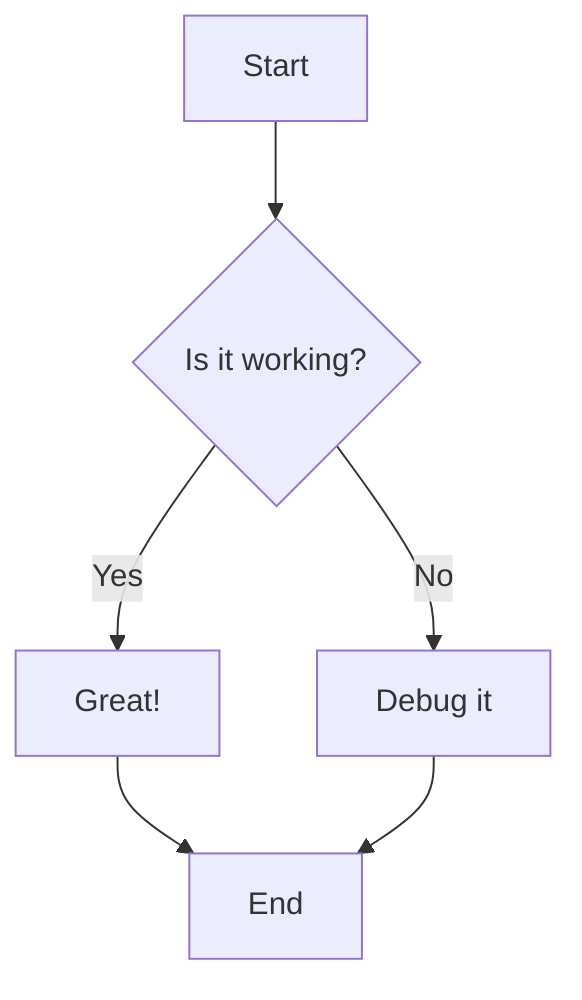
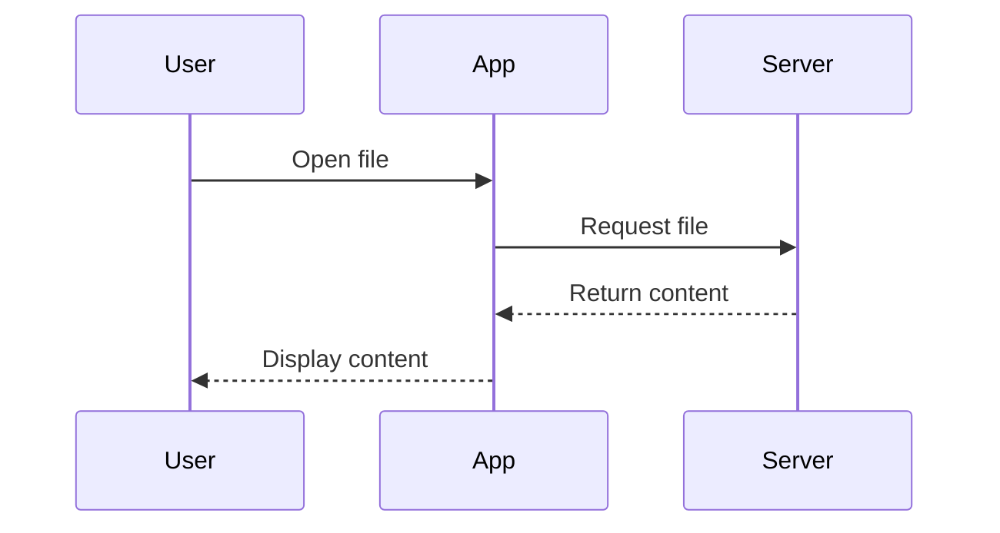
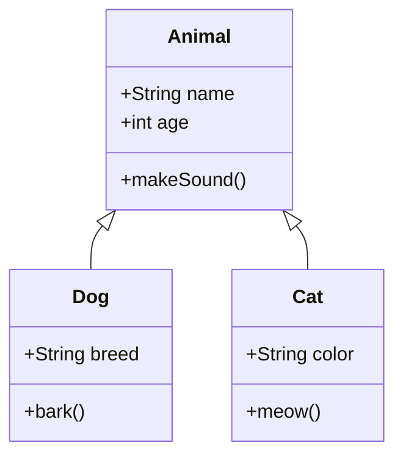
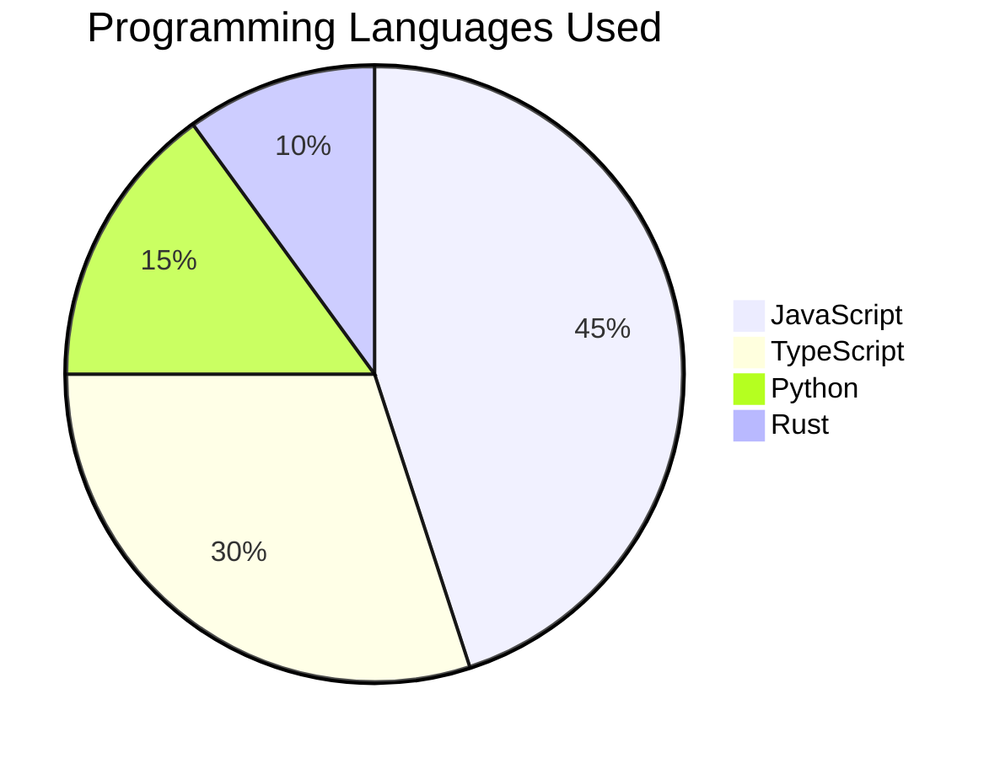
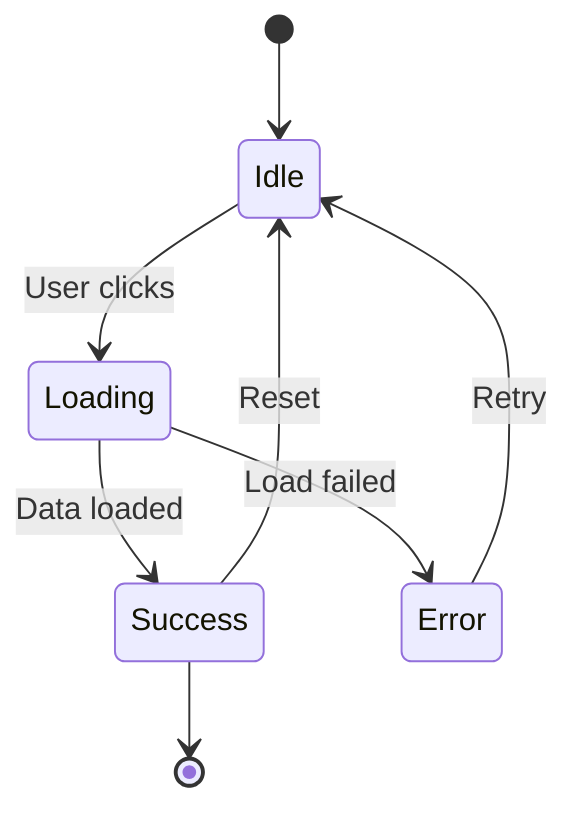
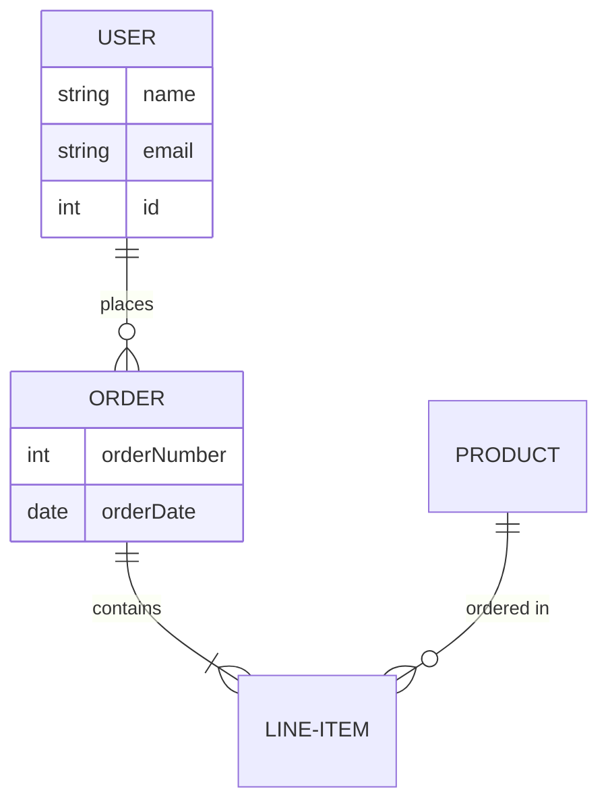

# Test Document for Manza

This is a test markdown file to verify the editor functionality.

## Features to Test

- **Bold text** works
- *Italic text* works
- ~~Strikethrough~~ works

## Task List

- [x] Open this file
- [ ] Edit this file
- [ ] See live preview

## Code Syntax Highlighting

### JavaScript

```javascript
function fibonacci(n) {
  if (n <= 1) return n;
  return fibonacci(n - 1) + fibonacci(n - 2);
}

const result = fibonacci(10);
console.log(`Fibonacci(10) = ${result}`);
```

### Python

```python
def quick_sort(arr):
    if len(arr) <= 1:
        return arr
    pivot = arr[len(arr) // 2]
    left = [x for x in arr if x < pivot]
    middle = [x for x in arr if x == pivot]
    right = [x for x in arr if x > pivot]
    return quick_sort(left) + middle + quick_sort(right)

print(quick_sort([3, 6, 8, 10, 1, 2, 1]))
```

### TypeScript

```typescript
interface User {
  id: number;
  name: string;
  email: string;
}

const getUser = async (id: number): Promise<User> => {
  const response = await fetch(`/api/users/${id}`);
  return response.json();
};
```

### Rust

```rust
fn main() {
    let numbers = vec![1, 2, 3, 4, 5];

    let sum: i32 = numbers.iter().sum();
    let doubled: Vec<i32> = numbers.iter().map(|x| x * 2).collect();

    println!("Sum: {}", sum);
    println!("Doubled: {:?}", doubled);
}
```

## Table

| Feature | Status |
|---------|--------|
| Editor  | Testing |
| Preview | Testing |

## LaTeX Math Rendering

### Inline Math

The Pythagorean theorem is $a^2 + b^2 = c^2$, and Euler's formula is $e^{i\pi} + 1 = 0$.

You can also write inline fractions like $\frac{1}{2}$ or exponents like $x^n$.

### Block Math

The quadratic formula:

$$
x = \frac{-b \pm \sqrt{b^2 - 4ac}}{2a}
$$

Einstein's famous equation:

$$
E = mc^2
$$

A summation:

$$
\sum_{i=1}^{n} i = \frac{n(n+1)}{2}
$$

An integral:

$$
\int_{0}^{\infty} e^{-x^2} dx = \frac{\sqrt{\pi}}{2}
$$

### Complex Notation

Matrix:

$$
\begin{pmatrix}
a & b \\
c & d
\end{pmatrix}
$$

Greek letters and symbols: $\alpha, \beta, \gamma, \Delta, \Sigma, \pi, \theta$

## Mermaid Diagrams

### Flowchart



### Sequence Diagram



### Class Diagram



### Pie Chart



### State Diagram



### Entity Relationship Diagram



Try editing this file!
